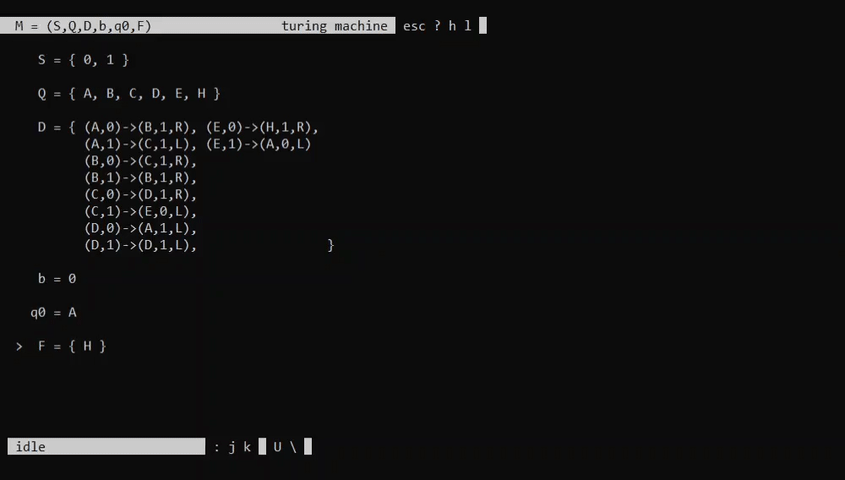
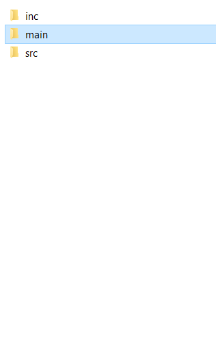
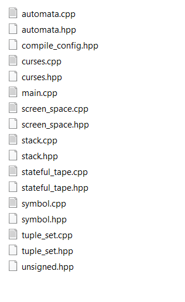
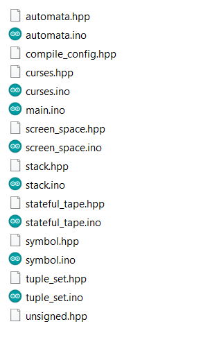
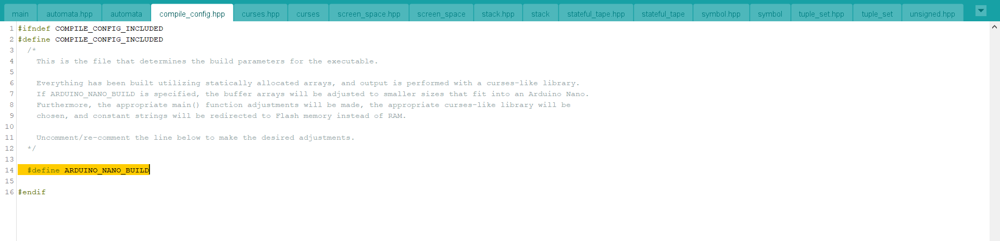
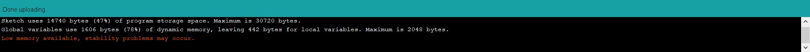

# Computaumaton Nano

A visual simulator for finite-state automata, pushdown automata, and turing machines small enough to run on an Arduino Nano. (That's 2048 bytes of RAM with IO over serial!)  

  
2-symbol 5-state [busy beaver](https://en.wikipedia.org/wiki/Busy_beaver) simulation running on Windows  

## guiding principle: visual illustration
The intention is to elucidate the nature of automata in a visual format without shying away from the rigorous mathematical substrate through which they are formally described. In simpler terms: it's technical, but it's not confusing. (hopefully.)  
An instructor's aid is recommended for pedagogical use. This is a simulator alone, so unfortunately there is no lecture component. However, it should help actively illustrate the function of these automata, without the student having to infer it from static mathematical notation.  
For the tinkering hobbyist who isn't quite convinced that PDAs can't recognize (a^n)(b^n)(c^n) (that was me a few years ago): have fun!

## guiding principle: efficiency
Educational software shouldn't be locked behind hardware requirements that are assumed to be "your average laptop", for oftentimes many in poor or rural areas don't have access to such hardware.  
In ensuring that this simulator runs smoothly on an Arduino Nano, it is guaranteed that no one will be unable to run this program. Not even a self-taught programmer running Windows Vista on a secondhand machine with 2gb of RAM, without means to buy better, and without any guarantee of a university education. (Once again, that was me quite a few more years ago.)  

# Compiling for Arduino Nano

1) create the directory "main/"  

2) merge src/ and inc/ into main/  

3) rename all .cpp files into .ino files  

4) open the files in Arduino IDE and uncomment `#define ARDUINO_NANO_BUILD` in compile_config.hpp  

5) upload the project to the Arduino Nano board!  

  